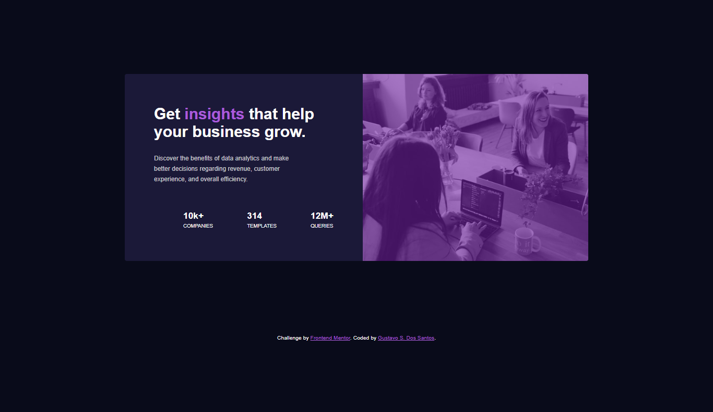

# Frontend Mentor - Stats preview card component solution

This is a solution to the [Stats preview card component challenge on Frontend Mentor](https://www.frontendmentor.io/challenges/stats-preview-card-component-8JqbgoU62). 
Frontend Mentor challenges help you improve your coding skills by building realistic projects. 

## Table of contents

- [Frontend Mentor - Stats preview card component solution](#frontend-mentor---stats-preview-card-component-solution)
  - [Table of contents](#table-of-contents)
  - [Overview](#overview)
    - [The challenge](#the-challenge)
    - [Screenshot](#screenshot)
    - [Links](#links)
  - [My process](#my-process)
    - [Built with](#built-with)
    - [What I learned](#what-i-learned)
    - [Continued development](#continued-development)
  - [Author](#author)
  - [Acknowledgments](#acknowledgments)

<!-- **Note: Delete this note and update the table of contents based on what sections you keep.** -->

## Overview

### The challenge

Users should be able to:

- View the optimal layout depending on their device's screen size

### Screenshot
\
 \
Preview for mobile

\
\

Preview for desktop

### Links

- Solution URL: [Stats-preview-card-component-main](https://github.com/GustavoSDS/stats-preview-card-component-main)
- Live Site URL: [gsds-stats-preview-card-component](https://gsds-stats-preview-card-component.netlify.app/)

## My process

### Built with

- Semantic HTML5 markup
- CSS custom properties
- Flexbox
- Mobile-first workflow

### What I learned

In the course of the project I learned a better use of html5 tags, use of display flex for greater control of my web pages.
In addition to learning the importance of the mobile firsts methodology. Which allows us to give higher priority to mobile devices, 
which are the ones that are used the most on a day-to-day basis.
For desktop development I learned to use media queries.

To see how you can add code snippets, see below:

```html
  <main>

    <section>
    </section>

    <section>
    </section>

  </main>
```
```css
/*       Media queries for  desktop       */
@media screen and (min-width:1200px) {
    main{
        width: 1110px;
        height: 448px;
        display: flex;
        flex-direction: row-reverse;
        margin: 178px auto;
    }
}
```

### Continued development

So far I am not completely familiar with flex displays, so I would like to continue learning more about it in future projects. As well as the use of media queries.

## Author

- Website - [Gustavo S. Dos Santos](https://github.com/GustavoSDS)
- Frontend Mentor - [@GustavoSDS](https://www.frontendmentor.io/profile/GustavoSDS)

## Acknowledgments

As a final conclusion, I want to thank youtuber David Ruiz, 
from [Coding Tube](https://www.youtube.com/c/CodingTube), for sharing his knowledge and helping the community.
